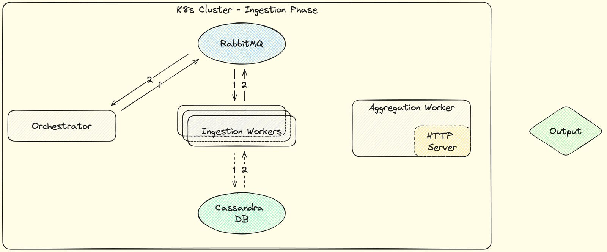
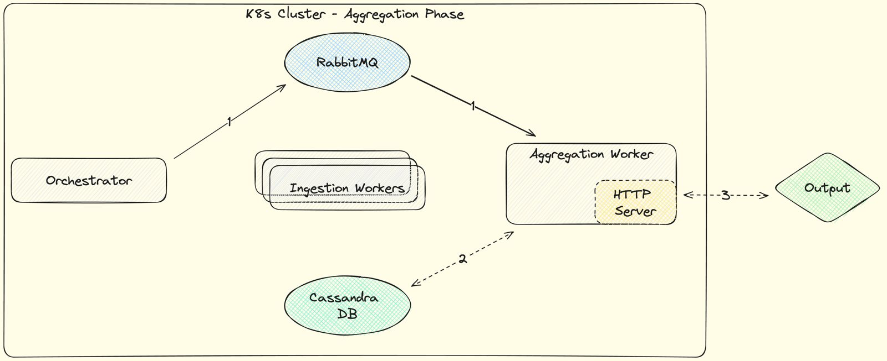

# Orchestrator

The orchestrator is the first step of the pipeline. It is responsible for orchestrating the data collection process using a RabbitMQ message broker. It is also responsible for creating the database and the tables.

## Overall Architecture

During the ingestion process, it creates the Cassandra DB and signals the workers what data to ingest from the twitter API. 

Then, each worker will ingest the data and store it in the Cassandra DB, notifying the orchestrator when it is done using the RabbitMQ.

The service flow at this point looks as follows:

Then, after the data has been ingested, the orchestrator will signal the next step in the pipeline, the data processing, where the aggregator will query the database and extract insights from the data.

The service flow at this point looks as follows:

## Cassandra Database

In order to allow for insightful analysis in an efficient manner, we decided to create a pre-structured dataset that corresponds to the insights that we plan to offer.

### Hashtags

- ⁠**Table Name**: ⁠ hashtag_stats ⁠
- ⁠**Primary Key**:
  - **Partition Key**: ⁠ tag_name ⁠
  - **Clustering Key**: ⁠ date_time ⁠
- ⁠**Columns**:
  - ⁠ date_time ⁠ (timestamp)
  - ⁠ tag_name ⁠ (text)
  - ⁠ number_of_likes ⁠ (int)
  - ⁠ number_of_shares ⁠ (int)
  - ⁠ country ⁠ (text)
  - ⁠ latitude ⁠ (float)
  - ⁠ longitude ⁠ (float)

### Author Popularity

- ⁠**Table Name**: ⁠ authors_stats ⁠
- ⁠**Primary Key**:
  - **Partition Key**: ⁠ author_name ⁠
  - **Clustering Key**: ⁠ date_time ⁠
- ⁠**Columns**:
  - ⁠ date_time ⁠ (timestamp)
  - ⁠ author_name ⁠ (text)
  - ⁠ number_of_likes ⁠ (int)
  - ⁠ number_of_shares ⁠ (int)
  - ⁠ country ⁠ (text)
  - ⁠ latitude ⁠ (float)
  - ⁠ longitude ⁠ (float)

### Emoji Stats

- ⁠**Table Name**: ⁠ emoji_stats ⁠
- ⁠**Primary Key**:, 
  - **Partition Key**: ⁠ emoji, author ⁠
  - **Clustering Key**: ⁠ date_time ⁠
- ⁠**Columns**:
  - ⁠ date_time ⁠ (timestamp)
  - ⁠ emoji ⁠ (text)
  - ⁠ author ⁠ (text)
  - ⁠ number_of_likes ⁠ (int)
  - ⁠ number_of_shares ⁠ (int)
  - ⁠ country ⁠ (text)
  - ⁠ latitude ⁠ (float)
  - ⁠ longitude ⁠ (float)
  